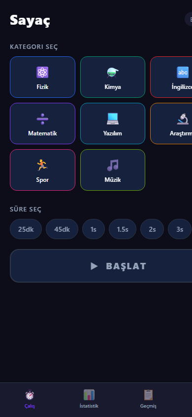

# birikim

Hayatını hangi alanlara verdiğini gören kişisel çalışma takip uygulaması.

"Bugün çalıştım mı?" sorusundan "Hayatımı hangi alanlara verdim?" sorusuna geçiş.

---

## Ekran Görüntüleri

<p align="center">
  
  
  
</p>

---

## Özellikler

- **Zamanlayıcı** — 30 dk, 45 dk, 1s, 1.5s, 2s, 3s veya özel süre
- **Kategoriler** — Renk ve isimle kişiselleştirilebilir çalışma alanları
- **Son 1 yıl ısı haritası** — GitHub tarzı günlük aktivite görselleştirmesi
- **Birikim grafiği** — Kümülatif saat bazında ilerleme
- **Seviye sistemi** — Acemi'den Efsane'ye rozet sistemi
- **Aktif timer koruması** — Uygulama kapansa bile zamanlayıcı devam eder

## Tech Stack

- [Expo SDK 56](https://expo.dev) + React Native 0.85
- TypeScript
- AsyncStorage (yerel veri)
- React Navigation (bottom tabs + native stack)
- react-native-chart-kit + react-native-svg

## Kurulum

```bash
git clone https://github.com/gulnurkilinc/birikim.git
cd birikim
npm install
npx expo start
```

Expo Go uygulamasını telefonuna yükle ve QR kodu tara.

---

Veri yalnızca cihazda saklanır, hiçbir sunucuya gönderilmez.
