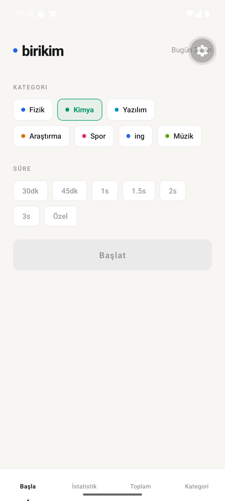
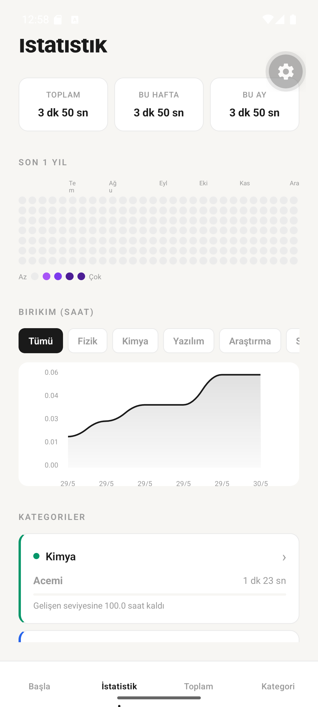
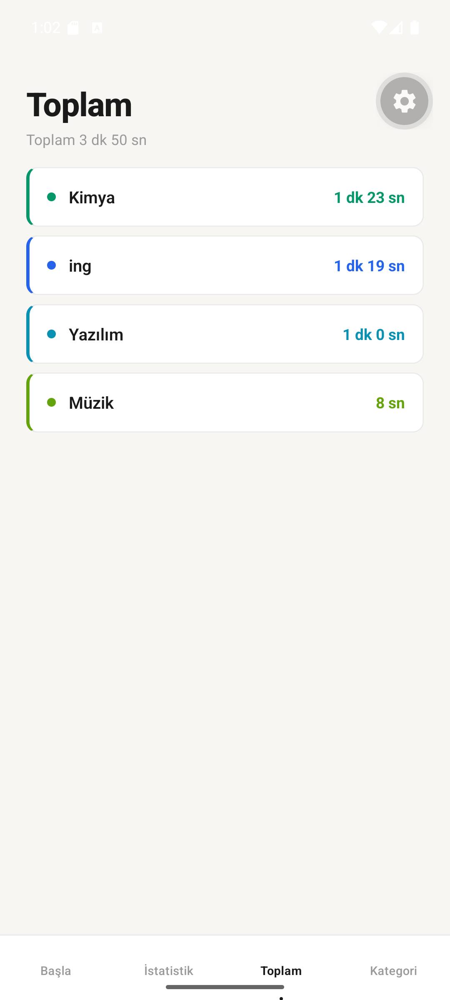
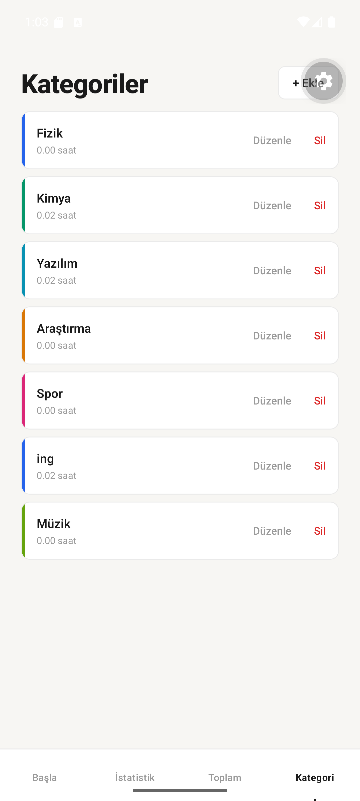

# birikim

Hayatını hangi alanlara verdiğini gören kişisel çalışma takip uygulaması.

"Bugün çalıştım mı?" sorusundan "Hayatımı hangi alanlara verdim?" sorusuna geçiş.

> English version below / İngilizce sürüm aşağıda

---

## Ekran Görüntüleri

<p align="center">
  
  &nbsp;
  
  &nbsp;
  
  &nbsp;
  
</p>

---

## Özellikler

- **Zamanlayıcı** — 30 dk, 45 dk, 1s, 1.5s, 2s, 3s veya özel süre
- **Kategoriler** — Renk ile kişiselleştirilebilir çalışma alanları
- **Son 1 yıl ısı haritası** — GitHub tarzı günlük aktivite görselleştirmesi
- **Birikim grafiği** — Kümülatif saat bazında ilerleme
- **Seviye sistemi** — Acemi'den Efsane'ye rozet sistemi
- **Aktif timer koruması** — Uygulama kapansa bile zamanlayıcı devam eder

## Kullanılan Teknolojiler

- [Expo SDK 56](https://expo.dev) + React Native 0.85
- TypeScript
- AsyncStorage (yerel veri)
- React Navigation (bottom tabs + native stack)
- react-native-chart-kit + react-native-svg

## Kurulum

```bash
git clone https://github.com/gulnurkilinc/birikim.git
cd birikim
npm install
npx expo start
```

Expo Go uygulamasını telefonuna yükle ve QR kodu tara.

Veri yalnızca cihazda saklanır, hiçbir sunucuya gönderilmez.

---
---

# birikim (English)

A personal time-tracking app to see how you invest your life.

Moving from "Did I study today?" to "Which areas have I truly dedicated my life to?"

---

## Screenshots

<p align="center">
  
  &nbsp;
  
  &nbsp;
  
  &nbsp;
  
</p>

---

## Features

- **Timer** — 30 min, 45 min, 1h, 1.5h, 2h, 3h or custom duration
- **Categories** — Color-coded, fully customizable areas of focus
- **Last 1 year heatmap** — GitHub-style daily activity visualization
- **Cumulative chart** — Hour-by-hour progress over time
- **Level system** — Badge progression from Beginner to Legend
- **Active timer persistence** — Timer keeps running even if the app is closed

## Tech Stack

- [Expo SDK 56](https://expo.dev) + React Native 0.85
- TypeScript
- AsyncStorage (local data only)
- React Navigation (bottom tabs + native stack)
- react-native-chart-kit + react-native-svg

## Setup

```bash
git clone https://github.com/gulnurkilinc/birikim.git
cd birikim
npm install
npx expo start
```

Install Expo Go on your phone and scan the QR code.

All data is stored locally on the device. Nothing is sent to any server.
